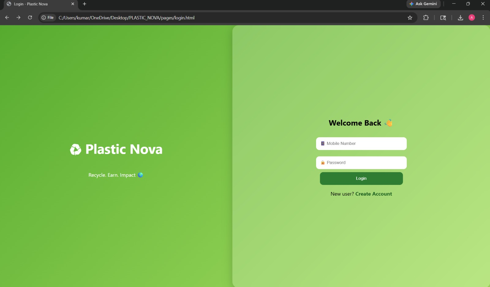
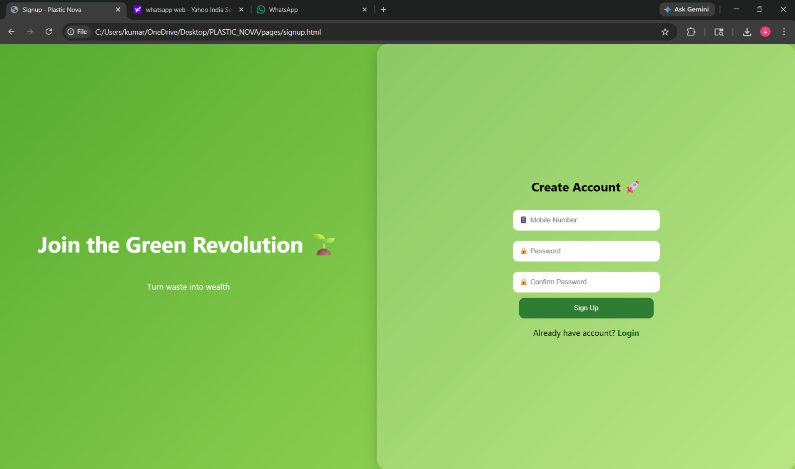

# ♻️ Plastic Nova

> **"From Waste to Worth — Building a Cleaner Future" 🌍**

---

## 🚀 About the Project

**Plastic Nova** is not just a project — it's a movement to transform plastic waste into valuable resources.
We aim to connect people, technology, and organizations to create a **cleaner and more sustainable environment**.
**Plastic Nova** - A smart platform to sell plastic waste, connect with buyers, and promote recycling through rewards and NGO drives.

---
## 💡 Problem Statement

Plastic waste is one of the biggest threats to our planet.
Lack of awareness, improper disposal, and weak connection between people and authorities make the problem worse.

---

## 🌟 Our Solution

Plastic Nova provides a smart platform that:

* ♻️ Encourages **eco-friendly practices like Ecobricks creation**
* 🛒 Enables **buying & selling of recycled products**
* 📍 Helps report garbage and connects with **nearby authorities for cleaning**
* 🤝 Creates a direct link with **NGOs** for better waste management and support

---

## 🔥 Key Features

### 🧱 Ecobricks Creation

Users can learn and contribute by creating **Ecobricks** — converting plastic waste into reusable building blocks.

### 🛍 Buy & Sell Marketplace

A platform where users can:

* Buy recycled products
* Sell eco-friendly or recycled items

### 🚮 Smart Waste Reporting

* Report garbage in your area
* Notify nearby authorities for cleaning action

### 🤝 NGO Integration

* Direct connection with NGOs
* Faster issue resolution
* Better environmental support

---

## 📱 Features (Planned & Ongoing)

* 🔍 Plastic identification *(future idea)*
* 📚 Recycling tutorials & guides
* 🎁 Reward system for eco-friendly actions
* 🌱 Awareness campaigns

---

## 🛠 Tech Stack

* Html , CSS
* 💻 JavaScript
* 🌐 GitHub

---

## 👥 Team Members

* 👤 Aditya kumar jha 
* 👤 saloni tyagi
* 👤 Abhishek Sharma 
* 👤 Pushkar 

---

## 📅 Project Progress

* ✅ Idea Finalized
* 🔄 Planning & Design Phase
* 🚧 Development in Progress

---

## 📌 Future Scope

* AI-based waste detection
* Live tracking of cleaning requests
* Collaboration with government bodies
* Gamification & rewards

---

## 🤝 Contributing

We welcome contributions!
Feel free to fork this repository and submit pull requests.

## Successfully created login/signup page and Home page
## 📸 Screenshots

### 🔐 Login Page
User authentication interface for secure access.

---

### 📝 Signup Page
New user registration screen.

---

### 🏠 Home Dashboard
Displays user impact, nearby buyers and NGO drives.
.jpg)

.jpg)
---

## 🌍 Vision

> “Plastic is not waste until we waste it. Plastic Nova turns waste into opportunity.” ♻️

---
